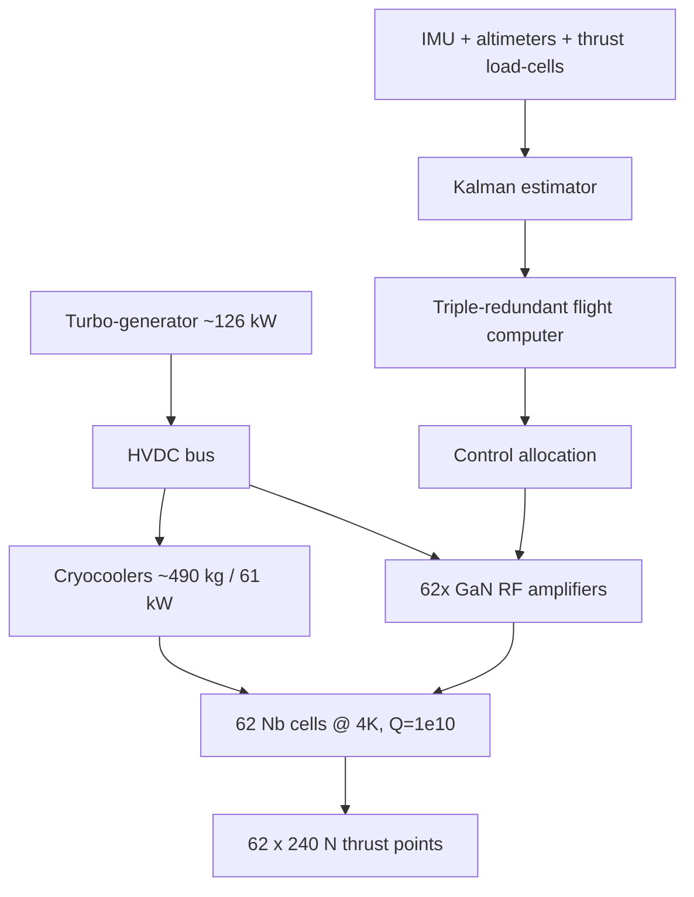

# Horizon-Drive Craft — LLM Drawing-Guide Specification

> 2026-07-05. **Purpose:** a complete, self-contained spec you can paste into ChatGPT / Claude / an
> image or diagram model to generate a **step-by-step visual build guide** (exploded views,
> cross-sections, per-module drawings, assembly sequence) of the horizon-drive craft. Every
> dimension, material, shape, and spatial relationship needed to *draw* the device is here — no
> external file required. Physics is ASSUMED proven (suspend-disbelief engineering); all numbers are
> the session-verified budget (`device_sim/budget.py`, `/tmp/craft.py`). Companion to the engineering
> memos and the `device_sim/` digital twin.

---

## 0. How to use this document with an LLM

This spec has three layers:
1. **§1–2 — the object atlas:** every part with its shape, dimensions, material, colour, and where it
   sits. This is what an LLM needs to *render* each component correctly.
2. **§3 — the drawing prompt library:** 14 ready-to-paste prompts, one per figure. Copy a prompt block
   into your LLM/image tool to get that specific drawing.
3. **§4 — the assembly sequence:** the ordered build steps, each mapped to the drawing that illustrates it.

**Recommended workflow:** paste §1 + §2 once as context, then paste each §3 prompt in turn to build the
guide figure-by-figure. For a text-diagram tool (Mermaid/SVG), use the schematics in §5 directly.

**Honesty note for the reader:** this is engineering fan-fiction with honest numbers. It depicts what the
machine's hardware would look like *if* the effect is real (an inertia modifier, not a reactionless
thruster — see the physics memos). It is a drawing target, not a claim the device works.

---

## 1. The craft at a glance (top-level object)

- **Class:** 1,000 kg (design), realistically first built at **2–3 t**; disc/hexagonal planform.
- **Overall form:** a wide, low disc — like a thick lens or a large drone. Thruster array on the
  **underside** (faces down), machinery stacked in the central body, landing legs below.
- **Approximate envelope:** ~2.6 m diameter (array + margin), ~1.0–1.3 m tall body.
- **Silhouette cue for drawings:** a matte-dark carbon-fibre disc, an underside honeycomb of ~62 small
  glowing copper-gold cone mouths, four slim landing legs, cooling radiators as fins around the rim.
- **Colour language:** carbon-fibre body = matte charcoal; superconducting cells = pale niobium grey with
  a faint blue cavity glow; cryostat = brushed steel; radiators = anodized black fins; wiring = copper.

**Mass / power headline numbers (put these on a title-block in drawings):**

| Quantity | Value |
|---|---|
| Thruster cells | **62** (build 72 with spares) |
| Thrust per cell | **240 N** (1 kW RF, Q=10¹⁰) |
| Total RF power | **62 kW** |
| Cryogenics power / mass | **61 kW · ~490 kg** (dominant mass) |
| Total electrical | **~126 kW** |
| Core dry mass | **~1,108 kg** |
| Control robustness (sim) | **100% survival, 40 randomized fault runs, ≤8 cells lost** |

---

## 2. Object atlas — every component to draw

Each entry: **shape · dimensions · material · location · drawing notes.**

### 2.1 Thrust cell (Module A) — the core repeated unit
- **Shape:** a **truncated cone (frustum)** — a cone with the tip cut off, mouth pointing down.
- **Dimensions:** big-end diameter **0.16 m**, small-end diameter **0.09 m**, length **0.12 m**, wall
  3–4 mm.
- **Material:** bulk niobium (pale silver-grey, slightly bluish); mirror-polished interior.
- **Attachments (draw these on the cell):**
  - a **coaxial RF power coupler** entering the big end (a short cylindrical port + ceramic window),
  - a **piezo frequency tuner** clamped across the body (a small actuator ring that squeezes the cone),
  - a **field-probe antenna** (thin pin) near the small end,
  - low-conductivity **composite support legs** (3, thin, holding it in the cold zone).
- **Drawing notes:** show the taper clearly (big end down = the "manufactured horizon"); a faint blue
  standing-wave glow inside; frost/cold cues (it's at 4 K).

### 2.2 Thruster array (Module B) — 62 cells on the underside
- **Shape:** a **hexagonal close-packed disc** of cells, all axes pointing down (nominal), a few canted
  slightly tangentially (for yaw).
- **Layout:** cells spread evenly over a disc of **radius ~1.2 m** (sunflower/hex pattern), grouped into
  **≥3 pie-slice sectors** that throttle independently.
- **Location:** the entire underside of the craft.
- **Drawing notes:** looking up at the belly, show ~62 cone mouths in a honeycomb; colour 3 sectors
  faintly differently; annotate "differential thrust = steering, no gimbals."

### 2.3 RF power chain (Module C)
- **Per cell:** a **GaN solid-state amplifier** (a finned aluminium box ~15×10×5 cm, ~1 kW). 62 of them.
- **Central:** one **master oscillator** (small rack unit) + phase-locked distribution (coax fan-out).
- **Per cell:** an **LLRF controller** card reading the field probe, driving amplitude/phase + tuner.
- **Location:** ring of amplifier boxes around the warm side, above the cryostat.
- **Drawing notes:** a circular manifold of 62 finned boxes with coax cables converging on a central
  oscillator; directional couplers as small T-junctions on each feed.

### 2.4 Cryogenic system (Module D) — the mass driver
- **Cryostat:** a **shallow cylindrical vacuum vessel** (brushed steel), ~2.4 m diameter, ~0.3 m deep,
  holding the whole cell array. Multi-layer insulation (gold-coloured MLI blanket) + an actively-cooled
  **radiation shield** (40–80 K, an inner shell).
- **Cryocoolers:** **distributed pulse-tube coolers** (several cylindrical units, ~1–2 W each at 4 K) OR a
  central helium refrigerator. **~490 kg total — the heaviest subsystem; draw it prominently.**
- **Location:** the cryostat is the structural heart, slung low; cryocoolers ring its top.
- **Drawing notes:** cross-section showing nested shells (300 K outer → 40–80 K shield → 4 K cells),
  MLI layers, and the cold cell array inside; thermal straps as copper braids.

### 2.5 Electrical power (Module E)
- **Source:** a **fuelled turbo-generator** (compact gas turbine, ~cylindrical, the size of a keg) +
  fuel tank — the only source that closes endurance (batteries don't). ~126 kW.
- **Bus:** **HVDC** distribution (thick cables + contactors) to the 62 amps and the cryocoolers.
- **Location:** turbo-generator + tank at the **centre of gravity** (central, low).
- **Drawing notes:** central turbine with intake/exhaust ducts, fuel tank beside it, a copper bus-bar
  ring feeding the amplifier manifold.

### 2.6 Thermal rejection (Module F)
- **Shape:** liquid-cooled **cold plates** on the amps + cryocooler warm ends, feeding **radiator fins**
  around the rim.
- **Location:** rim of the disc (like a heat-sink skirt); forced-air ducts/fans.
- **Drawing notes:** black anodized fin array around the circumference; coolant loop lines in red/blue.

### 2.7 Flight control (Module G)
- **Sensors:** an **IMU** (small cube), **altimeters** (radar + baro), **GPS/INS**, and per-sector
  **thrust load-cells**.
- **Computer:** a **triple-redundant flight computer** (three small boxes, voting).
- **Location:** central avionics bay, above the generator.
- **Drawing notes:** three FCC boxes with cross-links; sensor icons; a callout "unstable inverted
  pendulum — computer holds it upright 1000×/s."

### 2.8 Structure (Module H)
- **Frame:** a **carbon-fibre space-frame** (charcoal tubes) tying cryostat (low), generator+tank (CG),
  avionics, radiators (rim).
- **Landing gear:** 3–4 slim legs below the array.
- **Key detail:** **CG kept BELOW the thrust plane** (pendulum stability); the cryostat is vibration-
  isolated from the generator (microphonics detune the cavities).
- **Drawing notes:** show the frame as a lattice; mark the CG with the standard ⊕ symbol below the array
  plane; vibration isolators (springs/dampers) between generator and cryostat.

---

## 3. Drawing prompt library (paste these one at a time)

Each block is a ready-to-use prompt. Prepend "Using the component atlas I gave you," if your LLM needs the
reminder. Aim for technical-illustration / blueprint / exploded-CAD style.

**FIG 1 — Hero exterior (3/4 view).**
> Draw a technical 3/4 perspective render of a horizon-drive craft: a matte charcoal carbon-fibre disc
> ~2.6 m across and ~1.1 m tall, with an underside honeycomb of ~62 small glowing copper-gold cone
> mouths, black radiator fins around the rim, and four slim landing legs. Clean, sci-fi-but-plausible,
> blueprint-label style with a title block reading "Horizon-Drive Craft · 1 t class · 62 cells · 126 kW".

**FIG 2 — Underside plan (the array).**
> Draw a bottom-up plan view of the craft's underside: ~62 truncated-cone thruster mouths in a
> hexagonal/sunflower pattern over a 1.2 m-radius disc, grouped into 3 pie-slice sectors shaded slightly
> differently. Annotate "differential thrust = 6-DOF steering, no gimbals" and mark the 3 sector
> boundaries. Technical top-view line drawing.

**FIG 3 — Single thrust cell (detailed cutaway).**
> Draw a labelled engineering cutaway of ONE thrust cell: a niobium truncated cone, big end 0.16 m
> (down), small end 0.09 m (up), length 0.12 m, 3–4 mm wall, mirror interior with a faint blue standing-
> wave glow. Label: RF coaxial power coupler + ceramic window (big end), piezo frequency tuner ring
> (clamped on the body), field-probe pin (small end), 3 thin composite support legs, "operating at 4 K,
> Q=10¹⁰, 240 N at 1 kW". Blueprint style with dimension lines.

**FIG 4 — Cell fabrication sequence (5 panels).**
> Draw a 5-panel process strip for making one niobium cell: (1) two spun half-shells, (2) electron-beam
> welding them in vacuum, (3) chemical/electro-polish bath, (4) 800 °C vacuum bake + high-pressure water
> rinse in a cleanroom, (5) finished polished cone on a thrust-test stand reading "240 N @ 1 kW". Clean
> icon-style process diagram with arrows.

**FIG 5 — Cryostat cross-section (the cold heart).**
> Draw a vertical cross-section of the cryostat: a shallow steel vacuum vessel ~2.4 m diameter × 0.3 m
> deep, showing nested thermal shells — 300 K outer wall, gold multi-layer-insulation blanket, a 40–80 K
> actively-cooled radiation shield, and the 4 K cell array inside. Show copper thermal straps, low-
> conductivity support legs, and pulse-tube cryocoolers on top. Label "~490 kg — heaviest subsystem;
> every watt at 4 K costs ~500 W of compressor". Technical section view.

**FIG 6 — RF power manifold (plan).**
> Draw a top-view of the RF chain: a ring of 62 finned GaN amplifier boxes around the rim, coax cables
> converging on a central master oscillator, directional couplers as small T's on each feed, and per-cell
> LLRF cards. Label "phase-locked distribution; each amp holds its cavity on resonance". Technical
> schematic-illustration hybrid.

**FIG 7 — Power & thermal stack (side cutaway).**
> Draw a side cutaway of the central body stack (top to bottom): triple-redundant flight-computer bay,
> then the turbo-generator + fuel tank at the centre of gravity, an HVDC bus-bar ring, the RF amplifier
> ring, and the cryostat slung low. Show radiator fins around the rim with red/blue coolant loops. Mark
> the CG with a ⊕ symbol clearly BELOW the thruster plane. Label powers: "generator 126 kW · radiators
> reject ~126 kW waste heat".

**FIG 8 — Full exploded assembly view.**
> Draw a vertical exploded-view of the whole craft, components separated along the central axis and
> floating in stack order: (top) canopy/skin, flight computers, turbo-generator + fuel tank, HVDC bus,
> RF amplifier ring, cryostat lid + MLI + 40–80 K shield, the 62-cell array, radiator skirt, landing
> legs. Thin leader lines to a numbered parts list. Classic exploded-CAD illustration.

**FIG 9 — Steering by differential thrust (control diagram).**
> Draw a diagram showing how the craft steers: 4 small vector arrows over different sectors of the array,
> illustrating (a) climb = all cells up equally, (b) pitch/roll = more thrust on one side, (c) yaw =
> differential on the slightly-canted cells. No moving parts — "fly-by-wire, 62 thrust points commanded
> ~1000×/s". Clean vector-annotated schematic.

**FIG 10 — Fault tolerance (before/after a cell quench).**
> Draw a two-panel underside view: (left) all 62 cells firing evenly; (right) 5 cells greyed-out
> ("quenched"), with neighbouring cells brightened to compensate and the craft still level. Caption:
> "lose a cell → instant reallocation to neighbours, like a multirotor surviving a dead motor. Sim: 100%
> survival across 40 random fault runs, up to 8 cells lost." Technical comparison illustration.

**FIG 11 — Assembly step: array into cryostat.**
> Draw an assembly step: a technician (or robotic arm) lowering the qualified 62-cell array onto its
> low-conductivity supports inside the open cryostat, with thermal straps and RF feedthroughs being
> connected. Cleanroom setting. Instructional assembly-drawing style with a step number "STEP 2".

**FIG 12 — Commissioning ladder (flowchart).**
> Draw a vertical flowchart of the build/commissioning sequence: fabricate & thrust-qualify each cell →
> assemble & leak-check cryostat → cool to 4 K & re-tune every cavity → GROUND THRUST-STAND test →
> TETHERED HOVER on a gantry → free hover → translation → envelope expansion. Each box with a small icon;
> highlight the two gated "no-go if fails" tests (ground stand, tethered hover). Flowchart style.

**FIG 13 — Ground thrust-stand test.**
> Draw the whole craft bolted down to a heavy instrumented ground thrust-stand, cells firing, load-cells
> reading total thrust, a control console showing "vectoring authority OK / single-cell-fault
> reallocation OK". Safety enclosure, RF-shielding, cryo lines. Technical test-setup illustration with
> STEP number.

**FIG 14 — Tethered hover.**
> Draw the craft lifting a few centimetres off the ground on a safety gantry/tether, faint downward
> glow from the array, engineers at a console. Caption: "close the flight-control loop before free
> flight; uncrewed, geofenced, parachute-equipped." Illustration style.

---

## 4. Assembly sequence (each step → its figure)

| Step | Action | Draw with |
|---|---|---|
| 1 | Fabricate + SRF-process + **individually thrust-qualify** each cell (reject below 240 N / Q<10¹⁰). | FIG 3, FIG 4 |
| 2 | Build cryostat; install the 62-cell array on low-conductivity supports; leak-check to UHV. | FIG 5, FIG 11 |
| 3 | Integrate RF chain; bench-test each amplifier + LLRF loop warm. | FIG 6 |
| 4 | **Cool to 4 K**; verify Q and tune every cavity. | FIG 5 |
| 5 | Integrate power (turbo-generator + HVDC bus), thermal rejection, avionics, triple-redundant FCC. | FIG 7 |
| 6 | **GROUND THRUST-STAND TEST** (gate): full thrust, vectoring authority, single-cell-fault reallocation. | FIG 13, FIG 9, FIG 10 |
| 7 | **TETHERED HOVER** (gate): lift a few cm, close the flight loop, tune gains. | FIG 14 |
| 8 | Free hover → translation → slow envelope expansion, abort at every rung. | FIG 12 |

**Safety overlays to add to any assembly drawing:** RF enclosure + interlocks (60+ kW microwave);
cryogenic O₂-depletion monitors + cold-burn PPE; HVDC arc-flash protection; quench-energy containment;
uncrewed + geofenced + parachute for first flights.

---

## 5. Text schematics (for Mermaid / SVG tools)

**System block diagram:**


**Physical stack (top to bottom):**
```
   [ skin / canopy ]
   [ flight computers x3 ]
   [ turbo-generator + fuel tank ]   <-- centre of gravity
   [ HVDC bus ring ]
   [ RF amplifier ring (62) ]
   [ cryostat: 300K wall / MLI / 40-80K shield / 4K array ]
   [ 62-cell thruster array (faces down) ]
   [ radiator skirt + landing legs ]
        (CG kept BELOW this plane)
```

---

## 6. Verified numbers block (safe to quote in any figure)
| Quantity | Value |
|---|---|
| Cell frustum | Ø0.16 m → Ø0.09 m, 0.12 m long, Nb, Q=10¹⁰ @ 4 K |
| Thrust / cell | 240 N at 1 kW RF |
| Cells | 62 (build 72) over a 1.2 m-radius disc |
| RF power | 62 kW |
| Cryo | 61 kW, ~490 kg (500 W compressor per W at 4 K) |
| Total power | ~126 kW (turbo-generator; batteries don't close) |
| Dry mass | ~1,108 kg (first real craft 2–3 t) |
| Control | fly-by-wire differential thrust; 100% survival over 40 random fault runs (≤8 cells lost), worst error 0.28 m |

*All figures verified in-session (`device_sim/`, `/tmp/craft.py`) against CODATA constants under the
assumption the effect is real. This is a drawing target for a suspend-disbelief build, not a claim the
device works — see the physics memos for whether the effect is real at all.*
