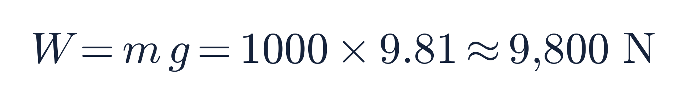
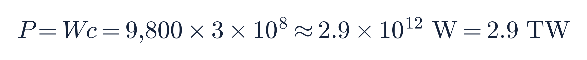
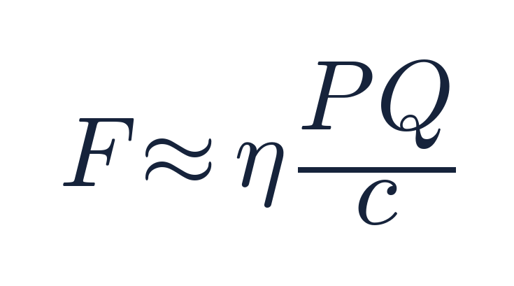
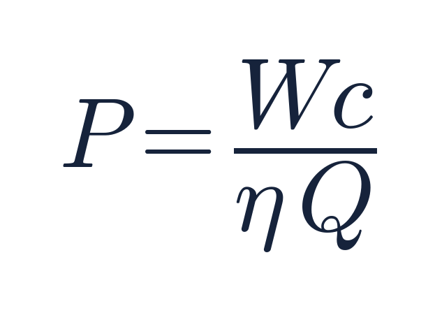

# The Only Honest Path to Anti-Gravity Runs Through Your Own Inertia

### We spent a deep-dive stress-testing every serious idea for defeating gravity. Most collapse under a single line of math — but one survives, and it's cheap enough to test on a lab bench.

*Draft · 2026-07-04*

---

*There is an old dream, older than rockets. Not to be thrown into the sky by brute force — a million pounds of burning kerosene clawing against the planet — but to simply* let go *of gravity's grip. To rise the way a thought rises. Every generation has chased it: inventors with spinning discs and secret coils, physicists with chalk-dusted equations, garage tinkerers with humming copper cavities that seemed, for a trembling afternoon, to weigh a little less. Almost all of them were wrong. But "almost" is a load-bearing word, and the interesting question was never whether the cranks were mistaken — they were. The interesting question is what's left standing after you clear them away.*

*So we cleared them away. We took every serious idea for defeating gravity, lined them up, and put each one against the physics we would bet our lives on. What follows is the honest tally — and the small, stubborn thing that refused to die.*

## Executive summary

"Anti-gravity" sounds like the border between physics and fantasy. But there's a serious, century-long scientific literature underneath it — Einstein, Casimir, Alcubierre, and a scattering of modern lab claims — and it deserves to be read carefully rather than mocked or believed.

So we did exactly that: we took every credible mechanism ever proposed for manipulating gravity or weight, and we ran each one against the physics we are essentially certain of — symmetry, energy conservation, general relativity, the measured constants of nature. Not "has it been debunked?" but "what does the math actually permit?"

The result is more hopeful than it first looks. Most of the famous ideas — bending light, rewriting Maxwell's equations, warp drives, "lightening" matter with the Higgs field — fail not because we lack imagination but because they run into walls that are *tens of orders of magnitude* wide. That sounds bleak. It isn't. Because those same walls point, by elimination, at the **one idea that doesn't hit a wall of fundamental physics at all**: the possibility that *inertia itself* — an object's resistance to being pushed — is not a fixed, God-given property, but something that emerges from the quantum vacuum and might, in principle, be nudged.

That idea has a real, published mechanism. It makes a falsifiable prediction that happens to match a famous unsolved puzzle in astronomy. And — remarkably — testing it does not require a Jupiter's worth of exotic matter or a particle collider. It requires a good vacuum chamber, a sensitive scale, and rigor. The "no" we found on every other path turns into a "not yet, and here's exactly how to find out."

This is the story of how we got there.

---

## Part 1 — The famous ideas, in plain language

Let's walk the landscape the way a curious non-physicist would, one idea at a time — from the most seductive to the most sober.

### Idea 1: "Just rewrite the rules of electricity and magnetism"

It's the first place everyone's imagination goes: light and electromagnetism feel like the most *manipulable* forces we have — we bend them, focus them, broadcast them across the world. Surely, the intuition goes, Maxwell's equations (the 150-year-old laws of electricity, magnetism, and light) are just the version we happen to know, and a deeper, "modified" version hides an anti-gravity trick.

Here's the beautiful problem: **Maxwell's equations are not a lucky guess you can freely edit.** They are *forced*. If you demand only a few things we're certain of — that the laws look the same to all observers, that they respect the symmetry called "gauge invariance," and that cause stays local — then Maxwell's equations are the *only* possibility. There's no free knob to turn.

You *can* modify them, but only in a short, known list of ways, and each one is either invisibly small or already measured and tiny: give light a mass (experiments say it's less than a *billionth of a billionth* of an electron's mass), or add nonlinear corrections (real! the vacuum does scatter light off light — but only at field strengths a thousand times beyond our strongest lasers). None of these permitted edits changes how light couples to gravity. It's a dead end — but a gorgeous one, because it shows how astonishingly rigid and well-built our theory of light actually is.

### Idea 2: "Use intense light to bend spacetime"

Light *does* gravitate. Einstein's relativity says every form of energy curves spacetime, light included — you could in principle build a "geon," a ball of light held together by its own gravity. So why not steer that?

Two brick walls. First, the energy in an electromagnetic field is always *positive*, which means light always curves spacetime the *attractive* way — it pulls, never pushes. Anti-gravity needs *repulsion*, which needs *negative* energy, which ordinary light simply cannot supply. Second, gravity is breathtakingly weak: the "stiffness" of spacetime is a number with 43 zeros in it. To warp space around a one-ton craft using stored light energy, you'd need the energy of a twenty-gigaton bomb — and it would still pull inward. Light and gravity touch, but the handle is far too small to grab.

### Idea 3: "Make matter lighter using the Higgs field"

This is the sharpest-sounding idea of all: the Higgs field is what gives particles mass, so if we could dial it down locally, couldn't we make a craft weigh less?

Two surprises, both fatal. First, **the Higgs is responsible for only about 1% of the mass of ordinary matter.** A proton's mass comes ~99% from the roiling energy of the strong nuclear force (gluons), not from the Higgs at all. Turn the Higgs off and a proton barely notices. Second, the *cost*: creating even a cubic-millimeter bubble of "low-Higgs" space means locally re-heating that speck to the conditions of the early universe — about **200 billion seconds of the Sun's entire energy output**, for a millimeter. It's not that the idea is unphysical; it's that it fights the vacuum energy of the universe to alter the wrong 1%.

### Idea 4: "Warp drives and exotic matter"

The Alcubierre warp drive is real, respectable physics — a valid solution of Einstein's equations that surfs a bubble of spacetime faster than light. The catch has always been that it needs *negative energy*, and lots of it.

How much? When physicists Pfenning and Ford did the careful accounting, the answer was staggering: a workable warp bubble would need a negative energy **exceeding the mass of the entire visible universe by a hundred billion times**, packed into a shell only a few hundred "Planck lengths" thick (the smallest meaningful distance in physics). Later refinements (Van Den Broeck, Bobrick–Martire, Lentz) chip the number down and even build "positive-energy" versions — a genuinely live and exciting research frontier — but every honest analysis still runs into the same energy-condition wall. Warp drive is not forbidden. It's just, for now, unaffordable by a cosmic margin.

### Idea 5: The negative-energy tease — Casimir

Here's the one place negative energy is *real* and *measured*. Put two metal plates a hair's breadth apart in a vacuum, and the space between them has slightly *less* energy than empty space — genuinely negative, confirmed in the lab in 1997 to within 5%. It's the seed of every warp and wormhole dream.

And in 2021, a NASA-linked team (Harold White and colleagues) found something striking: a tiny Casimir structure — a micron-scale sphere in a cylinder — produces a negative-energy *pattern* that qualitatively matches what a warp bubble would need. The headlines wrote themselves. But read the authors' own words and they're careful: it's a *qualitative correlation* at the scale of millionths of a meter, a suggestion to look closer, not a working device. The problem is scaling: the Casimir effect's strength falls off as the *fourth power* of distance, so it's mighty at nanometers and utterly negligible across anything you could ride in. The door is real; it's just currently the size of a keyhole.

### Idea 6: The lab-device claims — EmDrive, Woodward, Q-thrusters

Every few years a benchtop gadget claims a tiny thrust with no propellant: the EmDrive, Woodward's "Mach-effect thruster," the "quantum vacuum plasma thruster." These are the most tantalizing because they're *devices you can build* — and the most heartbreaking, because when independent labs (notably Tajmar's group in Dresden, 2018–2021) tested them with proper isolation, the thrust vanished into thermal and electromagnetic artifacts. Not fraud — just the brutal difficulty of measuring a force smaller than a mosquito's footstep. We'll come back to *why* this matters, because it's the key to the whole story.

---

## Part 2 — The idea that survives

Step back and look at the wreckage, because there's a pattern in it, and the pattern is the whole point. Every idea we just buried died for one of exactly two reasons: it's forbidden by *symmetry* (you can't edit Maxwell), or it's crushed by *orders of magnitude* (light is too weak, the Higgs too costly, warp too hungry). Those are *fundamental* walls — the kind that don't care how clever you are. A thousand years of engineering won't move them a millimeter.

Which is precisely why the survivor is interesting. There's one idea on the list we haven't really examined — and it fails for *neither* reason. It's the quietest one in the room, easy to walk right past. And by simple elimination, it's the last one standing.

### What if inertia isn't fundamental?

When you shove a heavy object, it resists. That resistance is *inertia* — and for 300 years we've treated it as a brute fact written into the equation F = ma. But *why* does matter resist acceleration? Newton didn't know. Einstein didn't fully answer it. It remains, quietly, one of the deepest unsolved questions in physics.

In the 1990s a bold answer appeared: maybe inertia is a *reaction to the quantum vacuum itself.* Two versions of this idea are worth keeping distinct, because they're often blurred together:

- **The Haisch–Rueda–Puthoff (HRP) proposal** (1994, refined 1998) says inertia is an electromagnetic effect — in their words, mass is *"not an intrinsic property of matter but rather a kind of electromagnetic drag force that proves to be acceleration dependent,"* and remarkably, they show *"Newton's equation of motion can be derived from Maxwell's equations… applied to the zero-point field of the quantum vacuum."* The vacuum's ever-present electromagnetic jitter pushes back on anything you accelerate — and that push-back, they argue, *is* inertia.
- **McCulloch's "quantised inertia"** (2007 onward) builds instead on the **Unruh effect** — the rock-solid fact that an accelerating object feels the empty vacuum as a faint warmth — and adds a twist: the longest of those vacuum waves are cut off by the horizons of the universe, and the resulting imbalance produces inertia.

Different machinery, same radical punchline. HRP put it plainly: because inertia and gravity would both be vacuum-electromagnetic phenomena, the theory *"opens the conceptual possibility of manipulation of inertia and gravitation."* If any of this is right, inertia isn't a fixed constant of an object — it's a *relationship* between the object and the vacuum, and relationships can, in principle, be *engineered.*

### The clue that this might be right

Here's what makes physicists sit up. McCulloch's version makes a specific, parameter-free prediction: inertia should slightly *weaken* at extremely low accelerations, below a threshold of about a ten-billionth of a meter per second squared.

That number is not arbitrary. It comes straight out of the theory as roughly *the speed of light times the expansion rate of the universe.* And astonishingly, it lands right on top of a famous unexplained number from a completely different field: the acceleration scale where galaxies start rotating "too fast" for their visible mass — the puzzle usually blamed on dark matter (and described by the "MOND" hypothesis). Two totally independent roads arriving at the same signpost is exactly the kind of coincidence that has, historically, preceded real discoveries.

(Honesty check, because this piece earns its optimism by being straight: none of this is proven, and both versions have serious published critics. The dark-matter coincidence also falls out of dark energy, so it's *suggestive, not decisive* — shared numerology. And the HRP calculation was directly challenged in a 2009 *Physical Review A* paper (Levy) arguing that when you do the force calculation *relativistically*, the effect HRP identified actually *"is shown to be equal to zero"* — i.e., that specific mechanism *"does not produce inertia."* The proponents dispute this, and McCulloch's horizon route is a partly independent argument, so the question is genuinely open rather than closed. But it's the only anti-gravity idea with a clue this good and a "no" that's still contested rather than fundamental.)

### Why this one is different: it doesn't hit a wall

Here is the punchline that makes the whole investigation end on a hopeful note. Manipulating inertia this way is **not** blocked by any fundamental wall:

- It needs *no* negative energy (unlike warp/Casimir).
- It needs *no* absurd energy budget (unlike the Higgs).
- It doesn't fight a 43-order coupling gap (unlike light-bending).
- It doesn't violate a symmetry (unlike editing Maxwell).

And through the equivalence principle — Einstein's tested-to-a-quadrillionth fact that inertial mass and gravitational mass are the *same thing* — reducing an object's inertia would *also* reduce its weight. One lever, two payoffs: effortless acceleration *and* apparent anti-gravity, with no laws broken.

That's why it wins. Not because it's proven — it isn't — but because it's the only door on the entire corridor that isn't bolted shut by physics we're sure of.

---

## Part 3 — The technical nitty-gritty: how it could actually work

Now let's earn the deep dive. How would you *engineer* an inertia change, and — crucially — how would you *prove* you'd done it?

### The "horizon drive" concept

McCulloch's mechanism hinges on *horizons*. The faint Unruh vacuum-bath an accelerating object feels is made of waves, and the longest of those waves are limited by the size of the observable universe — the cosmic horizon. His claim: inertia comes from the *asymmetry* in that bath (a bit more push from behind than ahead when you accelerate), and if you could **manufacture a local horizon** — a boundary, closer than the cosmic one, that selectively blocks some of those vacuum waves on one side of your craft — you'd create an *artificial inertia gradient*, and the object would drift toward the low-inertia side. A thrust, from a cavity.

Is that energetically insane, like the warp drive? **No — and this is the good news.** Do the arithmetic on what it takes for a lab-sized cavity (say a meter across) to act as a horizon for the charged particles inside it, and the required internal acceleration corresponds to an electric field of only about **4 million volts per meter.** That's a strong field, but an entirely ordinary one — the kind found in modest lab equipment, not a particle collider. The premise is *lab-accessible.* Unlike every other idea in this article, the horizon drive doesn't fail an energy test.

### So why hasn't it worked yet? The signal-to-noise wall

If it's lab-accessible, why the string of failed EmDrive-style experiments? Because the predicted effect is *small* — and it lives in the exact same size range as the experimental *artifacts* that plague any thrust measurement. This is the real, honest bottleneck, and understanding it is what turns "it failed" into "here's how to win."

We worked out the noise budget for a decisive test. The predicted thrust for a 100-watt device is somewhere between a rock-solid floor (the trivial recoil of emitted heat — about a third of a *micro*newton, the weight of a grain of sand's shadow) and an optimistic, cavity-enhanced ceiling (up to a milli-newton). The spurious forces that can *fake* a thrust sit right in that same band:

- **Electromagnetic forces on the power wires.** Ten amps flowing through a lead in the Earth's magnetic field produces about **50 micronewtons** of force — potentially *hundreds of times larger than the real signal.* This is the single worst offender, and it's why sloppy setups see "thrust."
- **Outgassing.** In a mediocre vacuum, gas molecules quietly boiling off a warm surface act like a tiny rocket — easily a micronewton. Only a proper ultra-high vacuum kills it.
- **Thermal recoil.** A device that radiates its waste heat even slightly asymmetrically gets a photon push. Small, but real.

The claimed signal and these artifacts are *the same size.* That's why naive experiments have a signal-to-noise ratio of about one — they literally cannot tell a real effect from a warm, buzzing wire. Every historical "positive" lacked at least one crucial control.

### The experiment that would settle it

Here's the constructive, hopeful part: the decisive test is completely *specifiable*, and it's not exotic. To lift the real signal clear of the noise, you need to drive every artifact below about **33 nano-newtons** (ten times under the trivial photon-recoil floor), and then ask a sharp question: *is there any thrust exceeding that floor?* The recipe:

1. **Ultra-high vacuum** (better than a hundred-billionth of atmospheric pressure) — erases outgassing and residual-gas forces.
2. **A radiative thermal shroud** holding temperature differences under a twentieth of a degree, with deliberately symmetric heat emission — erases thermal recoil.
3. **The electromagnetic fix that matters most:** superconducting or perfectly twisted-and-balanced power leads, a mu-metal magnetic shield, and a *current-reversal null test* — because if you flip the current direction and the "thrust" flips too, it was never thrust, just a wire in a magnetic field.
4. **The clinching controls:** flip the whole device around (a *real* thrust reverses with the device; an artifact doesn't); run a dummy heater that dissipates the same power with no cavity; detune the cavity so it has power but no resonance. Real physics survives all three; artifacts don't.
5. **A torsion balance** with nano-newton resolution and an in-vacuum laser readout.

Build that, and you get a *clean answer either way.* The best existing version of this experiment (Tajmar's, in Dresden) pushed the artifacts down and saw the "thrust" fade to nothing — strong evidence that the specific inertia-engineering claim, at *today's* sensitivity, isn't there. But that's not a closed door; it's a *ruler.* It tells us exactly how much better the next experiment has to be, and there's nothing in physics that says it can't be built.

---

## Part 4 — The back-of-the-envelope: what would a one-ton craft actually need?

Let's do the thing the cranks never do: run the numbers all the way, out loud, and let them fall where they fall. Suppose — *suppose* — the effect is real. Not "suppose magic"; suppose specifically that the thrust these cavities are claimed to produce is genuine and behaves the way the theory says. What would it take to lift a **one-ton craft** (1,000 kg) off the ground?

**The weight we're fighting.** To simply hover, the craft's engine must push down on the world (or the vacuum) as hard as gravity pulls the craft down. That force is its weight:

About the push of a small car's full engine thrust. That's the number to beat, continuously, for as long as we want to stay up.

**Reality check #1 — the honest floor.** Every powered device that radiates energy produces *some* thrust for free: the recoil of the light and heat it throws off, exactly like a flashlight feeling a feather-faint kick. That "photon rocket" force is *F = P/c*. To get 9,800 N of it, you'd need

That's **roughly three thousand nuclear power plants** to hover one ton. So the brute-force version is hopeless — and that's *why* nobody's flying on photon recoil. The whole game is whether the exotic effect gives you enormously more push per watt.

**Reality check #2 — the claimed effect, taken at its word.** The lab claims (NASA Eagleworks and kin) and McCulloch's theory both point to the same shape of formula — the thrust is the photon-rocket force *multiplied by the resonant quality* Q of the microwave cavity (how many times a wave bounces before dying), times a geometry factor η:

We can pin down η honestly by *calibrating it to the claim itself*: Eagleworks reported roughly **1.2 millinewtons per kilowatt** at a cavity quality of about Q ≈ 5×10⁴. Plug that in and η ≈ 0.007. (We're not inventing a number — we're forcing the formula to reproduce the actual claim, then asking where it leads.)

**The payoff table.** Rearranging for the power needed to hover our ton —

— everything now hinges on one knob: how good a cavity can you build? Cavity quality Q is a real, measurable engineering number, and it ranges over an *enormous* span:

| Cavity quality Q | What it is | Power to hover 1 ton |
|---|---:|---:|
| 5×10⁴ | Eagleworks-class copper cavity | **8.2 GW** (a nuclear plant) |
| 10⁶ | a good room-temperature cavity | 410 MW |
| 10⁸ | a cryogenic cavity | 4.1 MW |
| 10¹⁰ | **superconducting RF cavity** (routine in particle accelerators) | **41 kW** |
| 10¹¹ | the best superconducting cavity ever built | **4.1 kW** |

Read that last block again. Superconducting radio-frequency (SRF) cavities — the workhorses of every modern particle accelerator — *routinely* reach Q ≈ 10¹⁰, and record cavities push 10¹¹. If the claimed thrust genuinely scaled with Q that far, hovering a one-ton craft would take **somewhere between 4 and 41 kilowatts** — the output of a few electric-car motors. To actually *climb* at a comfortable 1 g (not just hover) you roughly double that: call it **~80 kW**, a sports car's engine, to lift a ton straight up against gravity, silently, with no propellant.

That is the number that makes this whole subject impossible to fully dismiss. It is not a Jupiter of exotic matter. It is not a warp bubble the size of the cosmos. It is a wall socket and a very good resonator.

**Now the three-fold catch — because the "if" is doing tremendous work.** For that 80-kilowatt flying car to exist, *all three* of these must be true, and each is a real gamble:

1. **The claimed thrust (η ≈ 0.007) has to be real** — not the thermal-expansion and stray-magnetic artifacts that Tajmar's careful Dresden experiments showed it to be, at the cavity qualities tested so far. *Current evidence: against.*
2. **The thrust has to keep scaling linearly with Q** all the way up to superconducting 10¹⁰–10¹¹. This is the load-bearing assumption of the entire dream, and it has **never been demonstrated** — nobody has run a clean, high-Q superconducting version of the test. *Current evidence: unknown — genuinely open.*
3. **A one-ton craft has to physically carry** a 10¹⁰-quality superconducting resonator, its cryogenics, and tens of kilowatts of power. *This one is "merely" hard engineering — a problem, not a wall — but only if (1) and (2) hold.*

The physics, in other words, has quietly handed us a to-do list instead of a tombstone. Two of those three items are decided by a *single* experiment: build the clean, superconducting, null-background thrust test from Part 3, crank Q up, and watch. Either a real force climbs above the noise as Q rises — and the flying-car arithmetic above stops being a fantasy — or it doesn't, and we've honestly closed the last open door in the whole landscape. That is a remarkably cheap way to answer a remarkably large question.

---

## Part 5 — The catch that outranks all the engineering: a thermodynamic vise

Before we celebrate that 80-kilowatt flying car, we have to face the single most powerful objection in this entire subject — one that has nothing to do with vacuum chambers, artifacts, or measurement precision. It is a trap made of pure bookkeeping, and it is worth understanding exactly, because it is the reason a careful physicist's eyebrow goes up the instant these thrust numbers appear.

Everything in Part 4 quietly assumed the device is a **reactionless drive** — a machine that produces a continuous push while throwing *nothing* out the back, powered only by electricity. That "nothing out the back" is the seductive part. It is also, it turns out, the part that collides head-on with the most sacred law in physics.

### The one-line argument that should stop you cold

In 2015, McGill engineer Andrew Higgins wrote a short, devastating paper with a title that says it all: *"Reconciling a Reactionless Propulsive Drive with the First Law of Thermodynamics."* His conclusion is a single sentence:

> *"Any device with a thrust-to-power ratio greater than the photon rocket would be able to operate as a perpetual motion machine of the first kind."*

A "perpetual motion machine of the first kind" is the forbidden one — the machine that creates energy from nothing. Higgins is saying that any propellantless drive that beats the humble photon rocket isn't just unlikely; it is *free energy in disguise.* And free energy is the one thing physics is most certain cannot exist.

### Why it's true, in plain arithmetic

Here is the whole trap in three steps. Feed a drive a constant electrical power *P*. It makes a constant thrust *F*, so its thrust-to-power ratio is *k = F/P*. Now let it run.

The **power it delivers as motion** is force times velocity, *F·v = k·P·v* — and notice that grows as the craft speeds up. But the **power going in** is just *P*, fixed. So the moment the craft passes a critical speed —

> *v* = 1/*k*

— the energy it's pouring into its own motion *exceeds the energy you're feeding it.* Past that speed, you are getting out more than you put in. That is a perpetual motion machine. You could tap the surplus and power the world.

The genius of the photon rocket is that it sits *exactly* on the safe side of this line. Its thrust-to-power is *k = 1/c* (a feeble **3.33 micronewtons per kilowatt**), so its danger speed is *v = 1/k = c* — the speed of light, which nothing with mass can reach. Higgins puts it precisely: the photon rocket *"can only reach energy breakeven as the accelerated mass asymptotically approaches the speed of light."* It is safe by the thinnest possible margin, forever.

Now watch what happens to the exciting numbers from Part 4:

| Drive | Thrust-to-power *k* | Danger speed *v* = 1/*k* | Reachable? |
|---|---|---|---|
| Photon rocket | 3.33 µN/kW | *c* (299,792 km/s) | **Never** — safe |
| Eagleworks claim | 1.2 mN/kW | ~840 km/s (0.3% of *c*) | A fast probe could |
| Linear-*Q* dream (Q=3×10¹⁰) | ~0.72 N/W | **1.4 m/s** | **A slow walk** |

Read that last row again. If the linear-*Q* extrapolation were real, the machine would become a free-energy fountain at **walking speed.** As Higgins dryly notes, for drives *"on the order of 1 N/kW… this breakeven occurs at velocities low enough to be feasible with current technology"* — which is his polite way of saying the claim refutes itself. The very numbers that made the flying car look easy are the numbers that make it a thermodynamic impossibility.

This is a *stronger* objection than the usual "but momentum isn't conserved" complaint — and Higgins says so. A momentum violation is abstract; most people shrug. But *"a source of free and infinite energy… already at our technological disposal"* is not abstract. If these drives worked as claimed, your desk lamp could be wired to run the planet. The fact that it can't is the tell.

### The only escape — and the second jaw of the trap

There is exactly one way out of Higgins' vise: **admit the drive is not reactionless after all.** If it's secretly pushing against *something* real — expelling a hidden exhaust, or shoving on the quantum vacuum itself — then momentum and energy balance, the free-energy paradox dissolves, and the physics is legal again. This is precisely what the vacuum-propulsion theorists claim: the device pushes on the vacuum, and the vacuum pushes back.

But that escape walks straight into the other jaw. To push on the vacuum, the vacuum has to be a *thing you can push on* — it needs a rest frame, a "here" that the craft moves relative to. And it doesn't have one. As Caltech's Sean Carroll put it bluntly:

> *"There is a quantum vacuum, but it is nothing like a plasma. In particular, it does not have a rest frame, so there is nothing to push against."*

That's the vise closing. **If the drive is reactionless, it breaks the first law (Higgins). If it escapes by pushing on the vacuum, it needs a vacuum rest frame that doesn't exist (Carroll).** Either jaw alone is a serious problem; together they are why "propellantless cavity thruster" is, to most physicists, a phrase that answers itself.

### The crucial escape hatch — and why the honest frontier survives

Here is the part that matters for *this* article, and it's the reason the whole investigation doesn't just end here. **The vise clamps down on one specific claim: a continuous, reactionless *thrust*.** It says nothing about *changing an object's inertia.*

Those are genuinely different machines. A thruster claims to *produce force from nothing* — that's what triggers the free-energy trap. But a device that merely made matter *lighter* — that reduced its inertial mass — isn't a free-energy machine at all; it's a mass-changing machine, and you would still have to push on it, conventionally, to move it. No first-law violation, no phantom reservoir. The equivalence principle would then hand you the weight reduction for free.

This is exactly the fork the whole article has been walking toward. **Read as a reactionless thruster, the horizon drive is caught in the vise and almost certainly cannot work.** Read as a genuine *inertia-modifier* — McCulloch's actual claim, that the device changes how the craft couples to Unruh radiation and cosmic horizons — it sidesteps Higgins entirely, and its remaining challenge is the honest experimental one from Part 3, plus the deep question of whether "the horizon" can really serve as Carroll's missing reservoir.

So the thermodynamic vise doesn't kill the dream. It *disciplines* it. It says: stop pitching this as a magic cavity that makes free thrust — that version is dead on arrival by pure bookkeeping. If there is anything real here, it is not a reactionless thruster at all. It is a machine that changes what inertia *is* — and that, precisely because it doesn't promise something for nothing, is the only version still standing when the accountants leave the room.

---

## For the builders: a companion piece

There's an obvious next question — *suppose it works; what does the machine actually look like?* — and the answer is long enough, and technical enough, to deserve its own article. The short version is a lovely reversal: **granting the effect, the anti-gravity is the easy part.** A one-ton craft would need ~62 superconducting thrust cells, but keeping them at 4 kelvin dominates everything — ~490 kg of cryocoolers and ~61 kW of refrigeration, which is why the dry mass lands near ~1,100 kg before any fuel, and why the first real vehicle is a 2–3-ton demonstrator, not a flying car. The exotic physics behaves; the *refrigerator* is what you fight.

The full subsystem-by-subsystem blueprint — thrust cell, array, RF chain, cryogenics, power, thermal, flight control, structure, and the commissioning ladder from thrust-stand to tethered hover — is in the companion piece, **"How You'd Actually Build One: The Engineering Blueprint for a Horizon-Drive Craft."**

---

## The optimistic bottom line

We set out to test the wildest idea in propulsion against the soberest physics we have. Here's what we found, and why it's genuinely good news:

**The dead ends are beautiful.** The fact that you *can't* casually rewrite Maxwell, that light gravitates but gently, that the Higgs gives mass to only a sliver of matter — these aren't disappointments. They're a measure of how deeply we understand nature. A century of physics is doing exactly its job: telling us, precisely and honestly, which doors are bricked shut.

**And one door isn't.** By clearing away the impossible, we're left staring at the one question worth chasing — *what is inertia, really?* — and at a mechanism, quantised inertia, that answers it in a way that's testable, affordable, and tied to one of the great open puzzles of cosmology. It might be wrong. Its critics might be right. But it is the only anti-gravity idea whose "no" is *"we haven't measured carefully enough yet"* rather than *"the universe forbids it."*

That's the hopeful truth hiding inside a stack of null results: the most exciting frontier in gravity isn't a Jupiter-mass of exotic matter or a warp bubble the size of the cosmos. It's a vacuum chamber, a sensitive scale, and the humble, radical question of why things are hard to push. That experiment is buildable. Someone should build it.

---

*Author's note: every number in this piece — the Higgs's 1% share of proton mass, the warp drive's universe-times-a-hundred-billion energy bill, the 4-million-volt horizon-drive field, the 33-nanonewton test threshold — was derived and checked against the measured constants of physics, not asserted. The point of an honest look at a wild idea is that honesty is what makes the surviving possibility worth taking seriously.*

---

## Sources & further reading

For readers who want the primary literature (all open-access unless noted):

- **Inertia as a vacuum effect (the proposal):** Haisch, Rueda & Puthoff, *"Inertia as a Zero-Point-Field Lorentz Force,"* Phys. Rev. A **49**, 678 (1994); Rueda & Haisch, *"Inertia as reaction of the vacuum to accelerated motion,"* Phys. Lett. A **240**, 115 (1998), arXiv:physics/9802031; Haisch, Rueda & Puthoff, *"Advances in the proposed electromagnetic zero-point-field theory of inertia"* (1998), arXiv:physics/9807023.
- **Quantised inertia (the horizon route):** M. E. McCulloch, *"Minimum accelerations from quantised inertia,"* EPL **90**, 29001 (2010), arXiv:1004.3303; *"Galaxy rotations from quantised inertia and visible matter only"* (2017), arXiv:1703.01179; with a skeptical rebuttal in Renda (2019), arXiv:1908.01589.
- **The critique (read this too):** Levy, *"Inertia as a zero-point-field force: Critical analysis of the Haisch–Rueda–Puthoff inertia theory,"* Phys. Rev. A **79**, 012114 (2009).
- **The Unruh effect:** W. G. Unruh, *"Notes on black-hole evaporation,"* Phys. Rev. D **14**, 870 (1976).
- **Why warp drives are so costly:** Pfenning & Ford, *"The unphysical nature of 'warp drive',"* Class. Quantum Grav. **14**, 1743 (1997), arXiv:gr-qc/9702026.
- **The Casimir–warp near-miss:** White et al., *"Worldline numerics applied to custom Casimir geometry generates unanticipated intersection with the Alcubierre warp metric,"* Eur. Phys. J. C **81**, 677 (2021).
- **The equivalence-principle bound:** MICROSCOPE collaboration, final results, Phys. Rev. Lett. **129**, 121102 (2022).
- **The thermodynamic vise (read this before believing any thruster claim):** A. J. Higgins, *"Reconciling a Reactionless Propulsive Drive with the First Law of Thermodynamics,"* arXiv:1506.00494 (2015).
- **The momentum jaw:** S. Carroll, quoted in *Discover* (2014) — the quantum vacuum has no rest frame to push against; discussed in E. Siegel, *"How Physics Falls Apart If The EmDrive Works,"* Forbes/Starts With A Bang (2016).

---

## Companion pieces

This essay is the *physics* — is any of it real? Two companions take the next step:

- **[How You'd Actually Build One: The Engineering Blueprint for a Horizon-Drive Craft](antigravity-construction-companion-article-2026-07-05.md)** — *if* the effect were real, what does the machine look like? (Spoiler: the exotic part is trivial; the whole fight is refrigeration.) Includes a runnable 6-DOF flight simulation that survives losing 8 of 62 thrusters mid-flight.
- **[The Cavity Chamber: Where the Anti-Gravity Actually Happens](antigravity-cavity-chamber-deep-dive-2026-07-06.md)** — a deep dive into the one component that is at once the most speculative physics and the most mature engineering on the whole craft.

The open-source simulation lives at **[github.com/mmdebrahimi/horizon-drive](https://github.com/mmdebrahimi/horizon-drive)** — clone it and fly it yourself.
